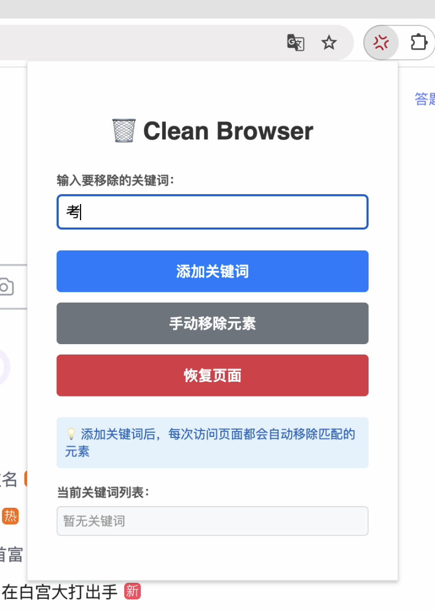
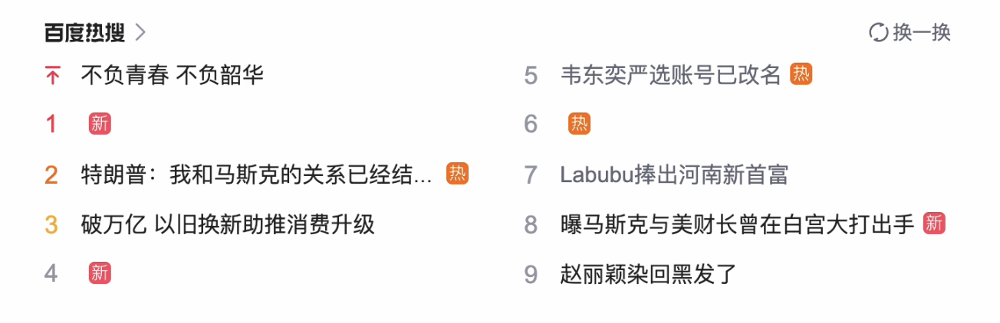
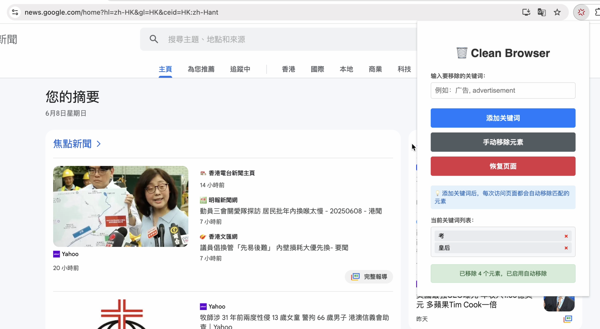

# Clean Browser - 浏览器元素移除器
## 重获在线信息的掌控权。

A powerful Chrome extension that automatically removes unwanted elements from web pages through intelligent keyword matching, giving you a clean and focused browsing experience.

---

## 🚀 功能特点 | Features


- ✅ **智能关键词匹配** - 精确识别包含指定关键词的页面元素
- ✅ **自动移除功能** - 页面加载时自动移除匹配元素，无需手动操作
- ✅ **动态内容监控** - 实时监控页面变化，移除动态加载的内容
- ✅ **表单元素保护** - 智能保护搜索框、输入框等重要交互元素
- ✅ **精确目标定位** - 优先移除最小相关元素，避免误删重要内容
- ✅ **一键恢复功能** - 随时恢复被移除的元素
- ✅ **数据持久化** - 关键词列表自动保存，跨会话有效
- ✅ **SPA应用支持** - 支持单页应用的路由变化检测


- ✅ **Smart Keyword Matching** - Precisely identify page elements containing specified keywords
- ✅ **Auto Removal** - Automatically remove matching elements on page load without manual intervention
- ✅ **Dynamic Content Monitoring** - Real-time monitoring of page changes to remove dynamically loaded content
- ✅ **Form Element Protection** - Intelligently protect search boxes, input fields and other important interactive elements
- ✅ **Precise Target Location** - Prioritize removing the smallest relevant elements to avoid accidentally deleting important content
- ✅ **One-Click Restore** - Restore removed elements at any time
- ✅ **Data Persistence** - Keyword lists are automatically saved and effective across sessions
- ✅ **SPA Support** - Support for single-page application route change detection

## 🎯 使用方法 | Usage



#### 添加关键词
1. 点击浏览器工具栏中的插件图标
2. 在输入框中输入要移除的关键词（如：广告、推广、营销）
3. 点击"添加关键词"按钮或按回车键

#### 自动移除
- 添加关键词后，每次访问页面都会自动移除匹配的元素
- 无需手动操作，享受干净的浏览体验





#### 管理关键词
- 点击关键词旁边的"×"按钮删除单个关键词
- 关键词会自动保存，重启浏览器后依然有效

#### 恢复页面
- 点击"恢复页面"按钮恢复所有被移除的元素
- 或刷新页面重新加载原始内容

#### Add Keywords
1. Click the extension icon in the browser toolbar
2. Enter keywords you want to remove in the input field (e.g., ads, promotion, marketing)
3. Click the "Add Keyword" button or press Enter

#### Auto Removal
- After adding keywords, matching elements will be automatically removed on every page visit
- No manual operation required, enjoy a clean browsing experience

#### Manage Keywords
- Click the "×" button next to keywords to delete individual keywords
- Keywords are automatically saved and remain effective after browser restart

#### Restore Page
- Click the "Restore Page" button to restore all removed elements
- Or refresh the page to reload original content

## 🎨 使用场景 | Use Cases

### 中文 | Chinese

- **搜索结果净化** - 移除百度、谷歌等搜索结果中的广告内容
- **新闻网站清理** - 去除新闻网站的推广文章和营销内容
- **电商网站优化** - 隐藏不感兴趣的促销横幅和广告
- **视频平台改善** - 移除视频网站的广告推荐
- **论坛内容过滤** - 过滤论坛中的垃圾帖子和广告
- **阅读体验提升** - 创造更专注的阅读环境

### English

- **Search Result Purification** - Remove ads from Baidu, Google and other search results
- **News Website Cleanup** - Remove promotional articles and marketing content from news sites
- **E-commerce Optimization** - Hide uninteresting promotional banners and ads
- **Video Platform Enhancement** - Remove ad recommendations from video websites
- **Forum Content Filtering** - Filter spam posts and ads in forums
- **Reading Experience Improvement** - Create a more focused reading environment

## 🛡️ 保护机制 | Protection Mechanisms

- **表单元素保护** - 自动保护搜索框、输入框、按钮等交互元素
- **重要容器识别** - 智能识别并保护主要页面结构
- **精确匹配算法** - 优先移除叶子节点，避免破坏页面布局
- **关键词密度检测** - 基于关键词占比判断是否为移除目标

- **Form Element Protection** - Automatically protect search boxes, input fields, buttons and other interactive elements
- **Important Container Recognition** - Intelligently identify and protect main page structures
- **Precise Matching Algorithm** - Prioritize removing leaf nodes to avoid breaking page layout
- **Keyword Density Detection** - Determine removal targets based on keyword proportion

## 📁 文件结构 | File Structure

```
├── manifest.json          # 插件配置文件 | Extension manifest
├── popup.html             # 弹出窗口界面 | Popup interface
├── popup.js               # 弹出窗口逻辑 | Popup logic
├── content.js             # 内容脚本 | Content script
├── background.js          # 后台脚本 | Background script
└── README.md             # 说明文档 | Documentation
```

## ⚠️ 注意事项 | Important Notes

- 插件只会隐藏元素而不是删除，确保页面功能不受影响
- 某些网站可能有反检测机制，插件效果可能受限
- 建议在移除元素前先备份重要内容
- 如果页面出现异常，可以通过"恢复页面"按钮或刷新页面来恢复

- The extension only hides elements rather than deleting them, ensuring page functionality is not affected
- Some websites may have anti-detection mechanisms that could limit the extension's effectiveness
- It's recommended to backup important content before removing elements
- If the page behaves abnormally, you can restore it using the "Restore Page" button or by refreshing

## 🤝 贡献 | Contributing

欢迎提交问题和改进建议！| Issues and improvement suggestions are welcome!

---
